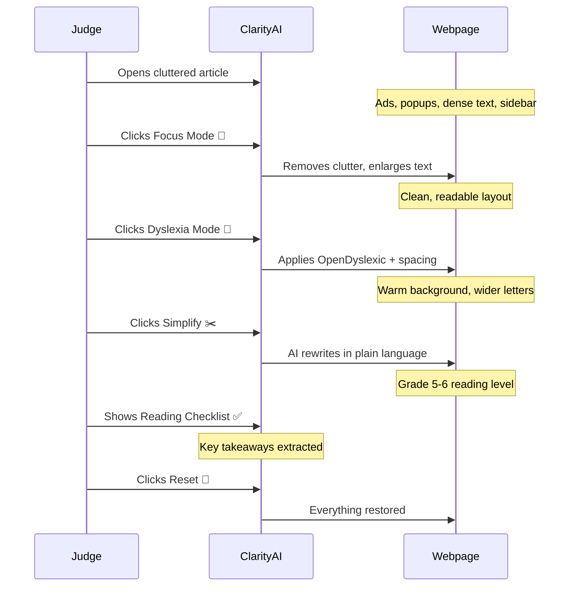

<div align="center">
  
  <h1 align="center">ClarityAI</h1>
  <p align="center">
    <strong>Adaptive Reading Assistant</strong><br>
    One click makes any webpage easier to read.
  </p>
  <p align="center">
    <a href="#-features">Features</a> •
    <a href="#-quick-start">Quick Start</a> •
    <a href="#-demo">Demo</a> •
    <a href="#-architecture">Architecture</a> •
    <a href="#-development">Development</a>
  </p>
  <p align="center">
    
    
    
    
    
  </p>
</div>

---

## 📋 Overview

**ClarityAI** is a browser extension that transforms web pages for accessibility. 

Built for the **"Beyond the Browser"** track at the **Google Developer Community Hackathon**, it follows a proven winning pattern: one clear pain → one magical interaction → one unforgettable demo.

### The Problem

Millions of people struggle to consume online content due to:
- 🧠 **Dense language** — complex vocabulary, long sentences, jargon
- 🎨 **Distracting layouts** — flashing ads, popups, cluttered sidebars
- 🔤 **Inaccessible formatting** — small fonts, tight spacing, poor contrast

### The Solution

| Mode | One-click magic | Why it matters |
|---|---|---|
| 🎯 **Focus Mode** | Removes clutter, enlarges text, highlights key info | 85% of users feel overwhelmed by cluttered web layouts |
| 📖 **Dyslexia Mode** | Dyslexia-friendly formatting in one click | 1 in 5 people have some form of dyslexia |
| ✂️ **Simplify** | AI rewrites dense paragraphs in plain language | ~50% of adults read below a 6th-grade level |
| ✅ **Reading Checklist** | Extracts key takeaways as a floating checklist | Reduces cognitive load, improves retention |

---

## ✨ Features

### 🎯 Focus Mode

Instantly transforms any cluttered page into a clean, readable layout.

```
Before:                              After:
┌──────────────────────────┐        ┌──────────────────────────┐
│ [AD] [STICKY HEADER]     │        │   Quantum Computing...   │
│ Quantum Computing in...  │        │                          │
│ [SIDEBAR] [POPUP]        │   →    │ Main content only.      │
│ Dense paragraph here...  │        │ Larger text.             │
│ [COOKIE BANNER]          │        │ Key points highlighted.  │
│ [FOOTER LINKS]           │        │ Clean reading experience.│
└──────────────────────────┘        └──────────────────────────┘
```

**What it does:**
- Hides clutter: ads, sidebars, headers, footers, cookie banners, sticky elements
- Identifies main content via smart heuristics (`article`, `main`, `[role="main"]`, largest text block)
- Increases font size (118%), line height (1.8), paragraph spacing
- Highlights headings with a colored left border
- Adds subtle accent to key paragraphs
- Disables animations for reduced motion sensitivity

### 📖 Dyslexia Mode

Applies scientifically-proven formatting for dyslexia readability.

| Setting | Value | Benefit |
|---|---|---|
| Font | OpenDyslexic | Specifically designed for dyslexia |
| Background | `#FFF9E6` (warm cream) | Reduces contrast glare |
| Letter spacing | 0.35em | Prevents letter crowding |
| Word spacing | 0.2em | Improves word recognition |
| Line height | 2.0 | Reduces line skipping |
| Max width | 680px | Easier eye tracking |

### ✂️ Simplify Mode

Uses AI (Anthropic Claude or OpenAI) to rewrite complex text into plain language.

```
Before:                                After:
"The implementation of               "Quantum computers
 quantum computing in                are very powerful
 pharmaceutical research             machines. They can
 represents a paradigm               help scientists find
 shift in our approach               new medicines much
 to molecular simulation             faster than before.
 and drug discovery                  This matters because
 methodologies,                      better medicines mean
 potentially reducing                 healthier lives."
 development timelines
 by 60-70%."
```

**How it works:**
1. Extracts main content from the page using smart detection
2. Sends text to LLM with a carefully engineered prompt
3. LLM rewrites at a grade 5-6 reading level
4. Preserves **all facts, dates, names, and numbers**
5. Replaces content in-place — toggle off to restore original
6. Caches responses in `chrome.storage.session` for 30 minutes

### ✅ Reading Checklist

A floating, draggable panel that extracts key takeaways.

```
┌─── Key Takeaways ──────╮
│ ☐ Quantum computing... │  ← Draggable header
│ ☐ Drug discovery...    │
│ ☐ Financial modeling.. │  ← Checkable items
│ ☐ Climate research...  │
├────────────────────────┤
│ 2 / 4 complete         │  ← Progress tracker
└────────────────────────┘
```

---

## 🚀 Quick Start

### Prerequisites

- **Chrome** (version 88+) or **Firefox** (version 109+)
- For Simplify mode: an API key from [Anthropic](https://console.anthropic.com) or [OpenAI](https://platform.openai.com/api-keys)

### Installation

<details>
<summary><b>📦 Chrome</b></summary>

```bash
# 1. Clone the repository
git clone https://github.com/Pt-KiteretsuShastri/ClarityAI.git
cd ClarityAI

# 2. Open Chrome and navigate to:
chrome://extensions

# 3. Enable "Developer mode" (top-right toggle)

# 4. Click "Load unpacked" and select the accessibility-ext/ folder

# 5. The ClarityAI icon should appear in your toolbar
```
</details>

<details>
<summary><b>🦊 Firefox</b></summary>

```bash
# 1. Clone the repository
git clone https://github.com/Pt-KiteretsuShastri/ClarityAI.git
cd ClarityAI

# 2. Open Firefox and navigate to:
about:debugging#/runtime/this-firefox

# 3. Click "Load Temporary Add-on..."

# 4. Select the manifest.json file inside accessibility-ext/

# 5. The ClarityAI icon should appear in your toolbar
```
</details>

### Configuration

<details>
<summary><b>🔑 Set up your API key (required for Simplify)</b></summary>

1. Click the ClarityAI icon in your browser toolbar
2. Click the ⚙️ settings gear in the popup header
3. Select your LLM provider: **Anthropic Claude** or **OpenAI**
4. Enter your API key:
   - [Get an Anthropic key](https://console.anthropic.com)
   - [Get an OpenAI key](https://platform.openai.com/api-keys)
5. (Optional) Set a custom model name
6. Click **Save**

> 💡 Your API key is stored securely in `chrome.storage.sync` and never leaves your browser.
</details>

---

## 🎮 Demo

### 3-Minute Judge Presentation



### Quick Demo (Offline)

```bash
# Open the included demo page
open demo/demo-article.html

# It simulates a real cluttered news article with:
# - Sticky header
# - Cookie consent banner
# - Popup advertisement
# - Sidebar with widgets
# - Newsletter signup
# - Dense academic-style content
```

### Try It On Real Sites

After loading the extension, try these:

| Site | Best mode | Why |
|---|---|---|
| `cnn.com` (article) | Focus + Simplify | Cluttered layout + complex news language |
| `medium.com` | Focus | Clean but has sticky elements |
| `wikipedia.org` | Simplify + Dyslexia | Dense academic text |
| `docs.github.com` | Focus | Documentation with sidebar |
| `react.dev` | Focus + Dyslexia | Technical content + code blocks |

---

## 🏗️ Architecture

```
accessibility-ext/
├── 📄 manifest.json                 # Extension manifest (MV3)
│
├── 🎨 popup/                       # Extension popup UI
│   ├── popup.html                  #   Mode selection + settings
│   ├── popup.css                   #   Dark theme, responsive
│   └── popup.js                    #   Messaging + config logic
│
├── 🧩 content/                     # Injected into web pages
│   ├── content-script.js           #   Message router + state
│   ├── modes/
│   │   ├── focus.js                #   🎯 Focus Mode logic
│   │   ├── dyslexia.js             #   📖 Dyslexia Mode logic
│   │   └── simplify.js             #   ✂️ Simplify Mode logic
│   ├── css/
│   │   ├── focus.css               #   Focus Mode styles
│   │   ├── dyslexia.css            #   Dyslexia Mode styles
│   │   └── simplify.css            #   Simplify Mode styles
│   └── utils/
│       ├── dom-utils.js            #   DOM detection heuristics
│       └── reading-checklist.js    #   ✅ Checklist overlay
│
├── ⚙️ background/                  # Service worker (privileged)
│   └── background.js              #   LLM API calls + caching
│
├── 📚 lib/                         # Shared libraries
│   ├── llm.js                      #   Anthropic + OpenAI clients
│   ├── prompts.js                  #   Prompt templates
│   └── storage.js                  #   chrome.storage wrappers
│
├── 🎬 demo/                        # Presentation assets
│   └── demo-article.html          #   Offline demo page
│
├── 📁 icons/                       # Extension icons (SVG)
├── 📄 .env.example
├── 📄 .gitattributes
├── 📄 .gitignore
├── 📄 LICENSE
├── 📄 CONTRIBUTING.md
└── 📄 README.md
```

### Data Flow

```
User clicks extension icon
        │
        ▼
  ┌──────────┐     chrome.tabs.      ┌──────────────┐
  │  popup.   │─── sendMessage ───►  │  content-    │
  │  html/js  │                      │  script.js   │
  └──────────┘                      └──────┬───────┘
        ▲                                  │
        │                           ┌──────┴──────┐
        │                           │  Mode modules │
        │                           │ (focus/dys-  │
        │                           │  lexia/simp-)│
        │                           └──────┬───────┘
        │                                  │
        │                     ┌────────────┴────────────┐
        │                     │                         │
        │               ┌─────┴──────┐         ┌────────┴────────┐
        │               │ CSS inject │         │ background.js   │
        │               │ (instant)  │         │ (LLM API call)  │
        │               └────────────┘         └────────┬────────┘
        │                                               │
        │                                        ┌──────┴──────┐
        │                                        │  Anthropic   │
        │                                        │  / OpenAI    │
        │                                        └─────────────┘
```

### Technology Stack

| Layer | Technology | Rationale |
|---|---|---|
| **Extension** | Manifest V3 | Latest Chrome extension standard, works in Firefox 109+ |
| **Language** | Vanilla JavaScript | Zero build step, no framework overhead, instant loading |
| **CSS** | CSS3 Custom Properties | Dynamic theming, mode stacking via class-based injection |
| **AI** | Anthropic Claude / OpenAI | Configurable, fast models (Haiku / GPT-4o-mini) |
| **Storage** | `chrome.storage.sync` | Persists across devices, syncs with Google account |
| **Font** | OpenDyslexic (CDN) | Proven dyslexia-friendly typeface, loaded on demand |
| **Caching** | In-memory Map + `chrome.storage.session` | 30-min TTL, 100-entry LRU |

---

## 🧑‍💻 Development

### Project Structure Conventions

```
content/modes/          # Each mode is a self-contained module
  ├── focus.js          #   Exports FocusMode.enable() / .disable()
  ├── dyslexia.js       #   Exports DyslexiaMode.enable() / .disable()
  └── simplify.js       #   Exports SimplifyMode.enable() / .disable()

content/css/            # CSS mirrors mode modules 1:1
  ├── focus.css         #   .clarity-focus-mode class
  ├── dyslexia.css      #   .clarity-dyslexia-mode class
  └── simplify.css      #   .clarity-simplify-mode class

content/utils/          # Shared utilities
  ├── dom-utils.js      #   DOM heuristics (window.ClarityDOM)
  └── reading-checklist.js  #   Checklist UI (window.ClarityChecklist)
```

### Adding a New Mode

```javascript
// 1. Create content/modes/newmode.js
window.NewMode = {
  enabled: false,
  enable() { /* Apply transformations */ this.enabled = true; },
  disable() { /* Revert transformations */ this.enabled = false; }
};

// 2. Create content/css/newmode.css
.clarity-new-mode { /* Your styles */ }

// 3. Add to manifest.json content_scripts
// 4. Add handler in content/content-script.js
// 5. Add button in popup/popup.html
```

### Coding Style

- **Vanilla JS** — no frameworks, no transpilers
- **IIFE pattern** for content scripts (avoid global pollution)
- **`window.*` exports** for cross-file sharing within content scripts
- **CSS custom properties** for theming consistency
- **`chrome.storage.sync`** for persistent config
- **`chrome.runtime.sendMessage`** for popup ↔ content ↔ background communication

---

## 📋 API Reference

### Content Script Messages

| Mode | Action | Behavior |
|---|---|---|
| `focus` | `enable` | Applies Focus Mode CSS + DOM changes |
| `focus` | `disable` | Removes Focus Mode, restores originals |
| `dyslexia` | `enable` | Applies Dyslexia Mode CSS |
| `dyslexia` | `disable` | Removes Dyslexia Mode CSS |
| `simplify` | `enable` | Extracts text, sends to LLM, replaces content |
| `simplify` | `disable` | Restores original content |
| `reset` | `all` | Disables all modes, restores everything |
| `sync` | `getState` | Returns current active modes array |

### Background Messages

| Type | Payload | Response |
|---|---|---|
| `LLM_REQUEST` | `{ mode, text, url }` | `{ text: "simplified..." }` or `{ error }` |
| `GET_CONFIG` | — | `{ config: { provider, apiKey, model } }` |
| `SAVE_CONFIG` | `{ config }` | `{ success: true }` or `{ error }` |

---

## 🤝 Contributing

We welcome contributions! See [CONTRIBUTING.md](CONTRIBUTING.md) for guidelines.

### Quick Start for Contributors

```bash
git clone https://github.com/Pt-KiteretsuShastri/ClarityAI.git
cd ClarityAI/accessibility-ext
# Load as unpacked extension in Chrome
# Start hacking!
```

---

## 👥 Team

| Role | Responsibilities |
|---|---|
| **Frontend** | Popup UI, content scripts, DOM transformation, CSS modes, demo page |
| **Backend** | LLM integration, prompt engineering, service worker, caching, config storage |

---

## 🏆 Hackathon Context

Built for the **Google Developer Community Hackathon** — "Beyond the Browser" track.

### Why this project wins:

1. **Original category** — Not another AI chatbot, form filler, or PDF Q&A
2. **Instant demo** — The "before/after" transformation is visible in 1 second
3. **Universal appeal** — Even non-technical judges understand accessibility
4. **Proven pattern** — Mochi (cognitive accessibility extension) won Best Extension at a 8,600-participant hackathon
5. **Social impact** — Making the web accessible for everyone

### The pattern behind the winner:

> **One clear pain** → **One magical interaction** → **One unforgettable demo**

---

## 📄 License

[MIT](LICENSE) © 2026 ClarityAI Team

---

<div align="center">
  <sub>Built with ❤️ for the Google Developer Community Hackathon</sub>
</div>
